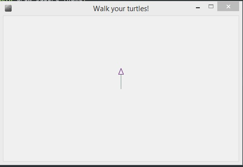
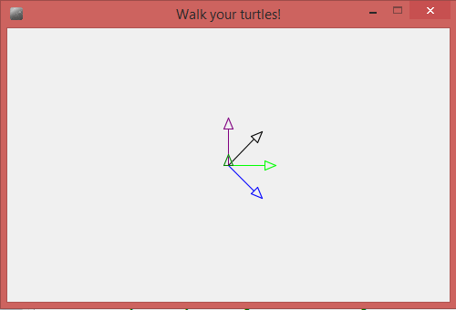
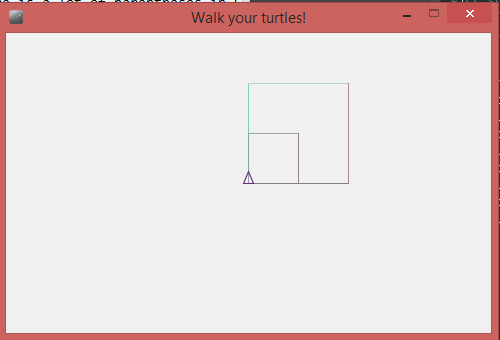
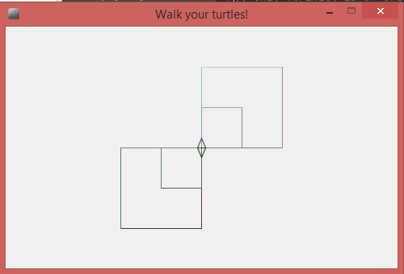

# How to Walk Turtles

Here are some instructions from very basic to a little bit high level
ones to walk turtles.

Walk them and draw lines by your imagination!

#### 1. Start up

We assume that you have successfully installed all the needed software during [Installfest](https://github.com/clojurebridge-boston/installfest)  and know how to start the programs we are using. Feel free to take a look there to check what these programs are and how to access them. Mentors are also here in case you have a question or something isn't working. 

If you haven't cloned the project repository yesterday at the [Installfest](https://github.com/clojurebridge-boston/installfest), follow the instructions there to install and open a `git` terminal and type (pressing enter after each command): 
```bash
git clone https://github.com/clojurebridge-boston/track1-turtles.git
cd track1-turtles
```
##### 1.1 Opening and running the project:

- Start Nightcode and open the project in Nightcode by clicking "Import" in the menu and choosing the folder where the project was downloaded (`track1-turtles`). 
- Open the project folder and its subfolder `src` in the left upper panel of Nightcode. 
- Click on the file `walk.clj` so that it is highlighted.
- In the right lower corner panel click on the button "Run with REPL". 
- Once the command finishes (it will print several lines ending with `=> user`; this may take a bit of time), click on Reload button.

You will see the following in the right bottom panel:
```clojure
user=> 
["walk.clj"]
clojurebridge-turtle.walk=> 
```
This is a place where you can type turtle commands. You will also see your first turtle in a little pop-up window! 

We will refer to the little pop-up window as the canvas since that's where turtles drawings go.

<!--
_EM commentt: Nightcode instructions instead:_

open the file
`track1-turtles/src/clojurebridge_turtle/walk.clj`.
Then,
<kbd>Ctrl</kbd> + <kbd>Shift</kbd> + <kbd>Enter</kbd> or
<kbd>Cmd</kbd> + <kbd>Shift</kbd> + <kbd>Enter</kbd> to evaluate the
file.

Once the turtles app starts running, evaluate each form (code fragment
enclosed by matching parentheses) by hitting,
<kbd>Ctrl</kbd> + <kbd>Enter</kbd> or
<kbd>Cmd</kbd> + <kbd>Enter</kbd> at the end of the line or function definition.


- load walk.clj on lein repl

startup repl, then run `require` and `ns`.

```clojure
user=> (require 'clojurebridge-turtle.walk)
nil
user=> (ns clojurebridge-turtle.walk)  ;; no need to run this on LightTable
nil
clojurebridge-turtle.walk=> (turtle-names)
[:trinity]
clojurebridge-turtle.walk=> (state)
{:trinity {:x 0, :y 0, :angle 90, :color [106 40 126]}}
```
-->


For the first few tasks you will be typing your commands into the right bottom area known as the REPL. REPL stands for Read-Evaluate-Print Loop, and it's a place to interact with Clojure: you type in what you want it to do, it performs the operation and gives you back the result. 

Place your cursor at the end of the line: 
```clojure
clojurebridge-turtle.walk=> 
```

Type `(forward 30)` and press enter:
```clojure
clojurebridge-turtle.walk=> (forward 30)
{:trinity {:length 30}}
clojurebridge-turtle.walk=> 
```

This command moves the turtle on the canvas forward by 30 pixels in the direction it is facing:




At some point in your interactions you may have many turtles on the canvas, so turtles are created with names to tell them apart. The very first turtle on the canvas is called `:trinity`. Note the colon `:` in front of the name; all turtle names will start with a colon. 

After you have entered a command, the turtle moves, and REPL displays what move it just made. In this case it said `{:trinity {:length 30}}` indicating the `:trinity` moved forward by 30 pixels. 

See [TURTLE.md](TURTLE.md) for commands that turtles understand. Experiment with moving `:trinity` around. 

##### 1.2 Helpful tips on interacting with Clojure

 - You can use up arrow in REPL to bring up the previous command. You can repeat it as is, or change it, and press enter. 

- `(undo)`, `(clean)`, and `(home)`

When the turtle has gone unexpectedly long or short distance, we can delete the
line one by one using `(undo)`.
If the turtle should start from its initial state,
a combination of `(clean)` and `(home)` commands takes the turtle back to
the initial state.

- `(state)`

When the turtle goes far away beyond the boundary, or you lost which
one is what, you can check where they are by this command. The command
returns absolute values from the position (0,0) in the middle of the canvas. Note that coordinates are computed with some rounding error, they are not whole numbers. 

For instance, when the following shows the state changes when `:trinity` starts at (0,0), moves forward by 20, then turns right 45 degrees, and moves forward by 20 again. 
```clojure
clojurebridge-turtle.walk=> (init)
:trinity
clojurebridge-turtle.walk=> (state)
{:trinity {:x 0, :y 0, :angle 90, :color [106 40 126]}}
clojurebridge-turtle.walk=> (forward 20)
{:trinity {:length 20}}
clojurebridge-turtle.walk=> (state)
{:trinity {:x -8.742278000372482E-7, :y 19.99999999999998, :angle 90, :color [106 40 126]}}
clojurebridge-turtle.walk=> (right 45)
{:trinity {:angle 45}}
clojurebridge-turtle.walk=> (forward 20)
{:trinity {:length 20}}
clojurebridge-turtle.walk=> (state)
{:trinity {:x 14.142134440416944, :y 34.142135932817126, :angle 45, :color [106 40 126]}}
```

[note] The `forward`/`backward` or `right`/`left` commands take a
relative value to the current state.

- `doc`

Without looking at command reference, we can check how to use each
function by Clojure's `doc`. For example, `(doc init)` displays
its usage:
```clojure
-------------------------
clojurebridge-turtle.core/init
([])
  returns to the starting state.
  only :trinity is in the home position.
nil
```

##### 1.3 How to deal with mistakes

If you made a mistake, you will get an error message from Clojure. 

For instance, if you mistype a command name, you would see something like this:
```clojure
clojurebridge-turtle.walk=> (frward 70)
CompilerException java.lang.RuntimeException: Unable to resolve symbol: frward in this context, compiling:(C:\Users\E\AppData\Local\Temp\form-init8602391256138879508.clj:1:1) 
clojurebridge-turtle.walk=> 
```
This means that Clojure doesn't know what `frward` is. 

Error messages may be very confusing at first. Don't forget to look at [TURTLE.md](TURTLE.md) to see how the commands should be used: a very small difference, such as using an upper case letter instead of a lower case, would make Clojure not understand a name or a function. You might want to keep [TURTLE.md](TURTLE.md) file open in a browser tab so that you can look at it as needed.

If something goes wrong, read what you just typed and the error message. Some things to know: _arity_ refers to how many arguments (i.e. things) a function is supposed to take. Sometimes Clojure will say that it cannot covert, or cast, on type of thing to another. That probably means that you are putting in a wrong type of an argument into a function (for instance, a name instead of a number). 

If you are getting an error and can't figure out what's wrong, ask one of the mentors. After a while you will learn common mistakes, and will be able to fix things easily. 

#### 2. [easy] Basic movement - forward, backward, right and left

- forward

```clojure
clojurebridge-turtle.walk=> (forward 40)
{:trinity {:length 40}}
```


- right

```clojure
clojurebridge-turtle.walk=> (right 90)
{:trinity {:angle 90}}
```


Try typing in the following movements, or some of your own, to move `:trinity` around. 

- combinations of forward and right:

```clojure
clojurebridge-turtle.walk=> (forward 40)
{:trinity {:length 40}}
clojurebridge-turtle.walk=> (right 90)
{:trinity {:angle 90}}
clojurebridge-turtle.walk=> (forward 50)
{:trinity {:length 50}}
clojurebridge-turtle.walk=> (right 90)
{:trinity {:angle 90}}
clojurebridge-turtle.walk=> (forward 60)
{:trinity {:length 60}}
clojurebridge-turtle.walk=> (right 90)
{:trinity {:angle 90}}
clojurebridge-turtle.walk=> (forward 70)
{:trinity {:length 70}}
clojurebridge-turtle.walk=> (right 90)
{:trinity {:angle 90}}
clojurebridge-turtle.walk=> (forward 80)
{:trinity {:length 80}}
```


- combination of various commands:

```clojure
clojurebridge-turtle.walk=> (init)
:trinity
clojurebridge-turtle.walk=> (forward 50)
{:trinity {:length 50}}
clojurebridge-turtle.walk=> (right 45)
{:trinity {:angle 45}}
clojurebridge-turtle.walk=> (backward 100)
{:trinity {:length -100}}
clojurebridge-turtle.walk=> (left 45)
{:trinity {:angle -45}}
clojurebridge-turtle.walk=> (forward 50)
{:trinity {:length 50}}
clojurebridge-turtle.walk=> (state)
{:trinity {:x -70.71068094436272, :y 29.289320335914155, :angle 90, :color [106 40 126]}}
```


#### 3. [easy] Multiple turtles

You can add multiple turtles. They all start in the middle, facing up, and are 
all of different colors. You can refer to each turtle by its name.

- add turtles

```clojure
clojurebridge-turtle.walk=> (init)
:trinity
clojurebridge-turtle.walk=> (add-turtle :neo)
{:neo {:x 0, :y 0, :angle 90, :color [12 84 0]}}
clojurebridge-turtle.walk=> (add-turtle :oracle)
{:oracle {:x 0, :y 0, :angle 90, :color [189 63 0]}}
clojurebridge-turtle.walk=> (add-turtle :cypher)
{:cypher {:x 0, :y 0, :angle 90, :color [75 102 125]}}
clojurebridge-turtle.walk=> (turtle-names)
[:trinity :neo :oracle :cypher]
```


Note that once you have more turtles than just `:trinity`, you need to specify what turtle your commands refer to. For instance, if you just type `(forward 30)`, you will get an error "Specify name. You have more than one turtle." 

- make turtles tilt different angles

Note that `*` denotes multiplication in Clojure, so `(* 2 45)` returns twice 45, which is 90. If we want each turtle to be facing at 45 degrees from the previous one, we can have Clojure do the multiplication for us. 

The parentheses around this expression mean that we are applying `*` to 2 and 45. Here `*` is a function, 2 and 45 are its parameters (also called "arguments"), and we say that we are calling multiplication function on 2 and 45. 

```clojure
clojurebridge-turtle.walk=> (right :neo 45)
{:neo {:angle 45}}
clojurebridge-turtle.walk=> (right :oracle (* 2 45))
{:oracle {:angle 90}}
clojurebridge-turtle.walk=> (right :cypher (* 3 45))
{:cypher {:angle 135}}
```


Feel free to change the multiplication function or its parameters to something else, see what happens. 

- walk four turtles forward

```clojure
clojurebridge-turtle.walk=> (forward :trinity 40)
{:trinity {:length 40}}
clojurebridge-turtle.walk=> (forward :neo 40)
{:neo {:length 40}}
clojurebridge-turtle.walk=> (forward :oracle 40)
{:oracle {:length 40}}
clojurebridge-turtle.walk=> (forward :cypher 40)
{:cypher {:length 40}}
```


#### 4. [easy] Add one more turtle and give them commands

_EM Ah, ok, we can set color. Need to add to the API and make a ref to RGB values (in the API and here)_

- add another turtle named :morpheus with color

```clojure
clojurebridge-turtle.walk=> (add-turtle :morpheus [21, 137, 255])
{:morpheus {:x 0, :y 0, :angle 90, :color [21 137 255]}}
```




- tilt and go forward :morpheus

```clojure
clojurebridge-turtle.walk=> (left :morpheus 45)
{:morpheus {:angle -45}}
clojurebridge-turtle.walk=> (forward :morpheus 40)
{:morpheus {:length 40}}
clojurebridge-turtle.walk=> (turtle-names)
[:trinity :neo :oracle :cypher :morpheus]
```


- walk five turtles forward by 20

```clojure
clojurebridge-turtle.walk=> (forward :trinity 20)
{:trinity {:length 20}}
clojurebridge-turtle.walk=> (forward :neo 20)
{:neo {:length 20}}
clojurebridge-turtle.walk=> (forward :oracle 20)
{:oracle {:length 20}}
clojurebridge-turtle.walk=> (forward :cypher 20)
{:cypher {:length 20}}
clojurebridge-turtle.walk=> (forward :morpheus 20)
{:morpheus {:length 20}}
```


#### 5. [easy - intermediate] Move all five turtles - Clojure functions

We've had five turtles and want to move or tilt those five.
Let's think how we can make all five turtles go forward by 40?
The simplest way would be to type `(forward :name 40)` five times.

But wait. We are almost exhausted to type quite similar commands many times.
Is there any handy way of doing this? Yes, there is.
Clojure has uses functions to accomplish this purpose.

<!--

_EM: commented out doseq_

`doseq` function is one of them.

- 5.1 move 5 turtles forward using `doseq` function

```clojure
clojurebridge-turtle.walk=> (doseq [n (turtle-names)] (forward n 40))
nil
```
-->


##### 5.1 using `map` function (a higher order function)

We can find out the names of all turtles by using `(turtle-names)`, this will give us a list `(:trinity :neo :oracle :cypher :morpheus)`. Then we can use a function `map` to go over the list and tell each turtle to move forward. 

If we want `:trinity` to move forward by 40, we say `(forward :trinity 40)`. If we want `:neo` to do the same, we say `(forward :neo 40)`. Note that the command is the same. What changes is the name, and we would like each of the turtles' names be used. 

`map` allows us to apply a function to each of the elements in a list and returns a list of all results. For example, we can apply a `forward` function to a list of names of all turtles on the canvas, and they all will move forward. 

We provide a "template" function for the command in which the name will be filled in for each turtle as the function goes through the list of names. The "template" function is `#(forward % 40)`, where the `%` is the turtle name that will be each of the turtles, one by one. 

```clojure
clojurebridge-turtle.walk=> (map #(forward % 40) (turtle-names))
({:trinity {:length 40}} {:neo {:length 40}} {:oracle {:length 40}} {:cypher {:length 40}} {:morpheus {:length 40}})
```
What do you think will happen if you type the following? 
```clojure
clojurebridge-turtle.walk=> (map #(forward % 40) [:neo :oracle])
```  

Can you now make all turtles turn right by 90 degrees using `map`?
Can you make only `:trinity` and `:morpheus` turn some more? Experiment with map until you are comfortable using it. Ask mentors questions if you have them. 

Note: don't try to make turtles do two things at once, in one `map`. We will get to it later.  

##### 5.2 using `map` (higher order function) and `juxt` functions

<!--
_EM: juxt is needed because you can't use comp: forward and friends do not return turtles> Need to explain briefly what juxt is. Show juxt on a single turtle?_
-->

What if you want to have all turtles move forward and then turn? You can do this in one `map` by passing a combination (a juxtaposition) of functions. 

Typing this makes `:neo` first turn right by 60 degrees, and move forward by 30 pixels: 
```clojure
clojurebridge-turtle.walk=> ((juxt #(right % 60) #(forward % 30)) :neo)
[{:neo {:length 50}} {:neo {:angle 30}}]
```  
Try this and other function combinations.    

If we want to make all turtles do a combination of steps, we can use `map` with `juxt`: 
```clojure
clojurebridge-turtle.walk=> (map (juxt #(right % 60) #(forward % 30)) (turtle-names))
([{:trinity {:angle 60}} {:trinity {:length 30}}]
[{:neo {:angle 60}} {:neo {:length 30}}]
[{:oracle {:angle 60}} {:oracle {:length 30}}]
[{:cypher {:angle 60}} {:cypher {:length 30}}]
[{:morpheus {:angle 60}} {:morpheus {:length 30}}])
```
Similarly, we can use map to make a group of turtles, but not all of them, perform a sequence of steps. To do this, you need to replace `(turtle-names)` with a group of some turtle names: `[:neo :morpheus]`. 

Experiment with `map` and `juxt`. 

#### 6. [intermediate] Define your own functions. 

Clojure has a lot of convenient functions, and we will see quite a few of them. However, if you want to do your own turtle drawings, you would need to write your own functions. It is convenient to give names to functions so that you can use them many times.

Let's say we want my turtle to draw a square. This movement consists of moving forward, turning right, and repeating this on each side of the square. We can write this movement as a function. We don't know which turtle we will be using, and we also want to make it so that we can draw squares of different sizes. Thus we will make the turtle name and the length of the side parameters to the function. 

The function is going to be fairly long, so it's inconvenient to write it in REPL. We will write functions in a file and then load them into REPL. 

- Find the file `yourcode.clj` in the left upper panel of Nightcode and double-click on it. 
- Copy the following code into that file under the things that are already there:
```clojure
(defn draw-square [name length]
  (forward name length)
  (right name 90)
  (forward name length)
  (right name 90)
  (forward name length)
  (right name 90)
  (forward name length)
  (right name 90))
```

Here is what's in it:

-  `defn` is a Clojure keyword for "define a function". You always use it when you want to define a function with a name. 
-  `draw-square` is the name of the function. You can pick whatever name you want. You can use dashes to separate words, but you may not use spaces in function names. 
- `[name length]` are the parameters. In order to tell a turtle to draw a square, we will need to provide a turtle name and the length of the side to the function.
- What follows is the function body, i.e. the commands it's composed of. Note that all our commands use the turtle name, and the `forward` uses the side length.
- Note that we enclose `defn` and the function body in parentheses. Click on the opening parenthesis before `defn` in Nightcode, it will show you the matching closing one (all the way at the end of the function). Nightcode helps you match parenteses (and there is a lot of parentheses in Clojure!)

Now that we have looked at how the function is defined, let's see how it works. 

Reload the file ("Reload" button in Nightcode or Ctrl-Shift-S on Windows, Cmd-Shift-S on a Mac). Nothing changed on the canvas. That's because we haven't actually tell our function to work, we only defined what it will do when it works. 

In the REPL panel (lower right) type `(init)` (to make sure that 
the canvas are back to initial state). Then type `(draw-square :trinity 100)`. You will see a nice square drawn by `:trinity`:


Now type `(draw-square :trinity 50)`. Now there are two squares drawn by `:trinity`. 



We can also have another turtle draw a couple of squares:



_EM: :neo draws a square_


_EM: refactor: take repeated code into a smaller function_

_map new function_

_Show: add turtles by mapping over a list of names_

_Exercise: draw a triangle_

<!-- _EM: somewhere here we also explain let - maybe?_ -->

#### Side note: map with multiple lists

_EM: this is useful, but not required_

#### ?? Exercise: chaotic turtles

_EM: make a bunch of turtles and move them in random directions_

#### Getting turtle information: keywords

#### Checking a condition

_EM: 'if;, the idea of true/false 

#### ?? Bouncing off the walls

_EM once a turtle is close to hitting a wall, it turns around_

#### ?. [intermediate] Exercise on filter

#### 7. [intermediate] Write a function that tilts five turtles in different directions

#### Recursion 

#### Exercises

License
-------
<a rel="license"
href="http://creativecommons.org/licenses/by/4.0/deed.en_US"></a><br
/><span xmlns:dct="http://purl.org/dc/terms/"
href="http://purl.org/dc/dcmitype/Text" property="dct:title"
rel="dct:type">ClojureBridge Curriculum</span> by <span
xmlns:cc="http://creativecommons.org/ns#"
property="cc:attributionName">ClojureBridge</span> is licensed under a
<a rel="license"
href="http://creativecommons.org/licenses/by/4.0/deed.en_US">Creative
Commons Attribution 4.0 International License</a>.
